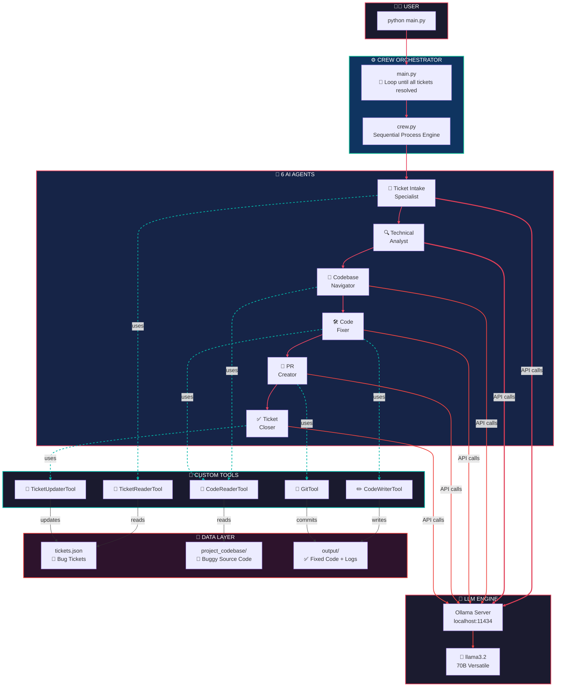
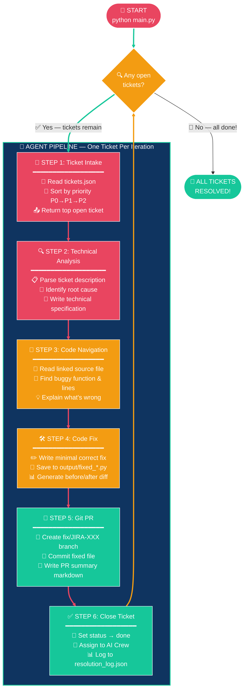

<div align="center">

# 🤖 Jira Solver Crew

### **Autonomous AI Bug-Fix Pipeline powered by CrewAI + Ollama**

[](https://www.crewai.com/)
[](https://ollama.com/)
[](https://python.org)
[]()

<br>

> **6 AI agents work together to read Jira tickets, analyze bugs, navigate code, write fixes, create git branches, and close tickets — fully autonomously.**

<br>


</div>

---

## 🏗️ Architecture Diagram



---

## 🔄 Execution Flow Diagram



---

## 📁 Project Structure

```
jira_solver_crew/
│
├── 🚀 main.py                    # Entry point — loops until all tickets resolved
├── 🤖 crew.py                    # 6 agents + 6 tasks + sequential crew
│
├── ⚙️ config/
│   └── llm_config.py             # Ollama llama3.2 configuration
│
├── 🔧 tools/
│   ├── ticket_reader.py          # Read + prioritize tickets.json
│   ├── code_reader.py            # Read source files with line numbers
│   ├── code_writer.py            # Write fixed code to output/
│   ├── git_tool.py               # Create branch + commit + PR summary
│   └── ticket_updater.py         # Update ticket status + resolution log
│
├── 🐛 project_codebase/
│   ├── auth/
│   │   └── login.py              # Bug: case-sensitive email lookup
│   └── forms/
│       └── signup.py             # Bug: no phone number validation
│
├── 🎫 tickets.json               # Simulated Jira board (3 tickets)
│
└── 📦 output/                    # Generated by the crew
    ├── fixed_login.py            # ✅ Corrected login code
    ├── fixed_signup.py           # ✅ Corrected signup code
    ├── pr_summary.md             # 📝 Pull request description
    └── resolution_log.json       # 📊 Resolution audit trail
```

---

## 🤖 The 6 Agents

| # | Agent | Role | LLM | Tools |
|:-:|-------|------|:---:|-------|
| 🎫 | **Ticket Intake Specialist** | Reads tickets.json, sorts by priority, returns top open ticket | llama3.2 | `TicketReaderTool` |
| 🔍 | **Technical Ticket Analyst** | Converts ticket description into precise technical specification | llama3.2 | — |
| 📂 | **Codebase Navigator** | Reads source files, finds exact buggy function and line numbers | llama3.2 | `CodeReaderTool` |
| 🛠️ | **Autonomous Code Fixer** | Writes minimal correct fix and saves to output folder | llama3.2 (temp=0.1) | `CodeReaderTool`, `CodeWriterTool` |
| 🌿 | **PR Creator** | Creates git branch, commits fix, writes PR summary markdown | llama3.2 | `GitTool` |
| ✅ | **Ticket Closer** | Marks ticket as done, updates resolution log | llama3.2 | `TicketUpdaterTool` |

---

## 🎫 Sample Tickets

| ID | Priority | Status | Bug | File |
|----|:--------:|:------:|-----|------|
| `JIRA-101` | 🔴 P0 | 🔄 open | Case-sensitive email login | `auth/login.py` |
| `JIRA-102` | 🟠 P1 | 🔄 open | No phone number validation | `forms/signup.py` |
| `JIRA-100` | 🟡 P2 | ✅ done | *(previously resolved by human)* | `forms/signup.py` |

---

## 🚀 Quick Start

### Prerequisites

| Software | Version | Purpose |
|----------|---------|---------|
| **Python** | 3.21+ | Runtime |
| **Ollama** | Latest | Local LLM server |
| **Git** | Optional | Real branch/commit (has fallback) |

### 1. Install Ollama & Pull Model

```bash
# Install Ollama from https://ollama.com
ollama pull llama3.2
ollama serve              # keep running in a terminal
```

### 2. Setup Python Environment

```bash
cd jira_solver_crew
python -m venv venv
venv\Scripts\activate     # Windows
# source venv/bin/activate  # macOS/Linux

pip install crewai crewai-tools gitpython
```

### 3. Run the Crew

```bash
python main.py
```

The crew **loops automatically** until all open tickets are resolved:

```
============================================================
  JIRA SOLVER CREW — Autonomous Bug Fix Pipeline
  Runs until ALL open tickets are resolved
============================================================

Pipeline: Intake → Analyze → Navigate → Fix → PR → Close

------------------------------------------------------------
  🔄 ITERATION 1  |  2 open ticket(s) remaining
  Next up: JIRA-101 — Login fails for mixed-case emails
------------------------------------------------------------

  ✓ Iteration 1 complete

------------------------------------------------------------
  🔄 ITERATION 2  |  1 open ticket(s) remaining
  Next up: JIRA-102 — Signup accepts invalid phone numbers
------------------------------------------------------------

  ✓ Iteration 2 complete

============================================================
  ✅ ALL TICKETS RESOLVED — No open tickets remaining!
============================================================
```

---

## 🔧 Custom Tools Reference

| Tool | File | Description |
|------|------|-------------|
| `read_tickets` | `tools/ticket_reader.py` | Reads `tickets.json`, filters open, sorts by priority, returns top ticket |
| `read_code_file` | `tools/code_reader.py` | Reads any source file with line numbers prepended |
| `write_code_file` | `tools/code_writer.py` | Writes code content to `output/` folder |
| `git_commit` | `tools/git_tool.py` | Creates branch, commits fix, writes PR summary *(fallback if Git not installed)* |
| `update_ticket` | `tools/ticket_updater.py` | Sets ticket status to done, appends to resolution log |

---

## ⚠️ Important Notes

> **Model Compatibility** — `llama3.2` support tool/function calling in Ollama. `llama3` and `codellama` do **NOT** work with CrewAI tools.

> **One Ticket Per Loop** — Each iteration resolves the single highest-priority open ticket. The main loop continues until zero remain.

> **Git Fallback** — If Git is not installed, the `GitTool` simulates branch/commit operations and still generates `pr_summary.md`.

---

## 📊 Output Files

After a successful run, check the `output/` folder:

| File | Contents |
|------|----------|
| `fixed_login.py` | Corrected login code (case-insensitive email) |
| `fixed_signup.py` | Corrected signup code (phone validation regex) |
| `pr_summary.md` | Pull request description with ticket ID, changes, and test steps |
| `resolution_log.json` | Timestamped resolution entries for each closed ticket |

---

## 🧩 How to Add Your Own Tickets

Edit `tickets.json` to add new bug tickets:

```json
{
  "id": "JIRA-200",
  "type": "bug",
  "priority": "P0",
  "status": "open",
  "title": "Your bug title here",
  "description": "Detailed description of what's broken and expected behavior.",
  "linked_file": "project_codebase/path/to/file.py",
  "assigned_to": null,
  "resolution_branch": null
}
```

Then add the buggy source file under `project_codebase/` and run `python main.py`.

---

## 📜 License

MIT License — free to use, modify, and distribute.

---

<div align="center">

**Built with using [CrewAI](https://www.crewai.com/) + [Ollama](https://ollama.com/) + [llama3.2](https://llama.meta.com/)**

<br>


&nbsp;

&nbsp;


</div>
